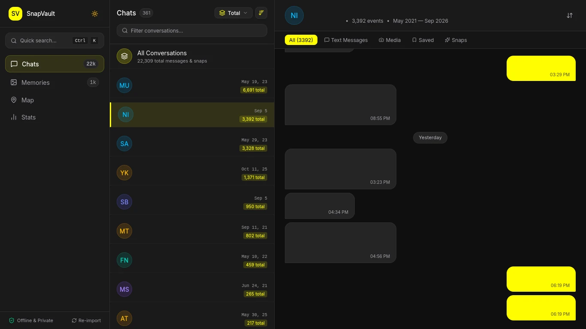
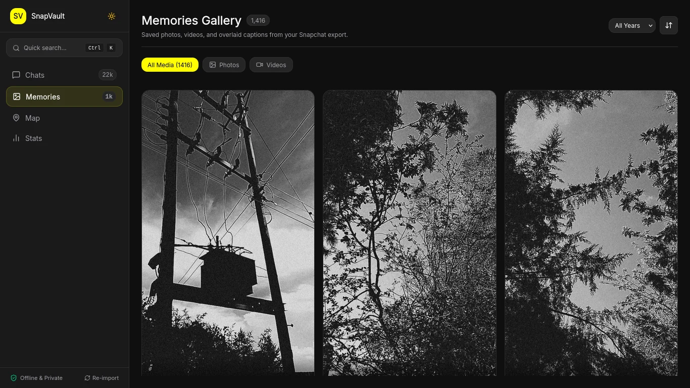
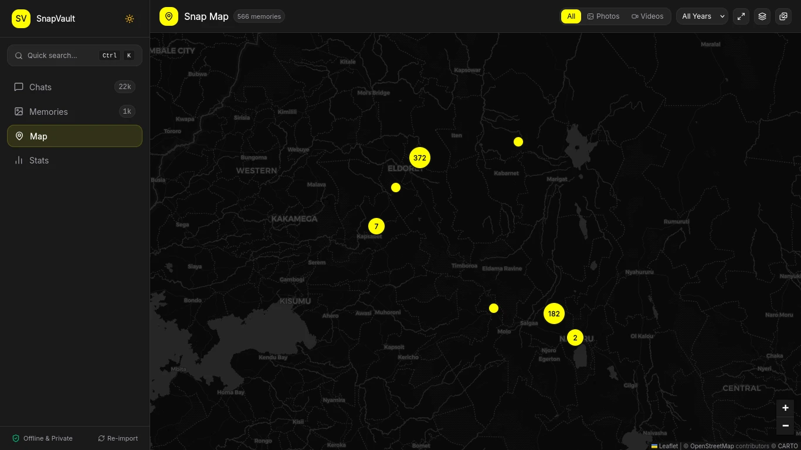
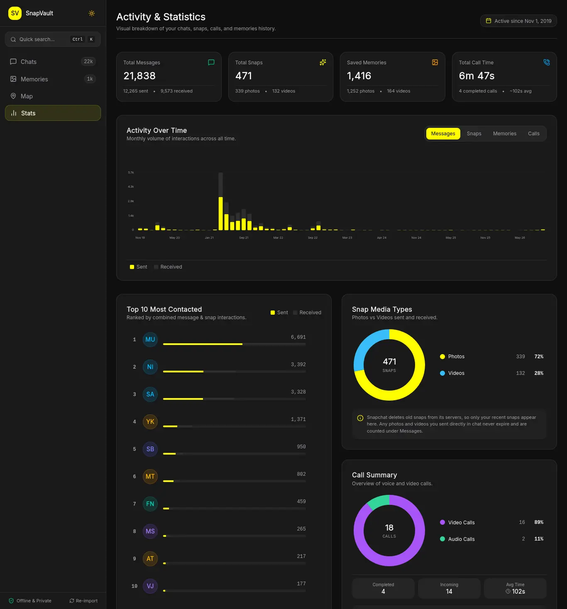

# SnapVault

A local-first, private web app for browsing your exported Snapchat data — chats, snaps, calls, memories, and geotagged locations — in one unified, searchable interface, instead of Snapchat's default export of isolated per-contact HTML pages.

## Why this exists

Snapchat's "Download My Data" export provides two main folders:

1. A `json/` folder containing the structured data (`chat_history.json`, `snap_history.json`, `talk_history.json`, `memories_history.json`, `feature_emails.json`).
2. An `html/` folder that renders a subset of that data into static HTML pages per contact, with no global search, no cross-contact view, and no link to your saved memories.

SnapVault skips the HTML files and reads the JSON files and media directly. This provides a unified timeline, interactive maps, full-text search across saved messages, and detailed activity statistics.

**Everything runs entirely in your browser.** There is no server, no data upload, and no network tracking. Your export never leaves your computer.

## Interface preview

### Chats view

Browse conversations per contact or through a unified timeline across all contacts. Saved messages display full text, while unsaved messages display media type tags and timestamps.



### Memories gallery

Browse saved photos and videos in a responsive masonry grid. Captions and stickers from overlay files are automatically layered on top of the original media.



### Snap Map

Explore geotagged memories on an interactive map. Memories are clustered dynamically by zoom level, with quick filters by media type and year.



### Activity and statistics

Review your Snapchat activity over time with interactive charts, top contacted friends, snap type ratios, and aggregate call logs.



## Features

- **Chat history viewer** — per-contact conversation view, plus a unified timeline across all contacts.
- **Memories gallery** — masonry grid browsing of saved photos and videos, with overlay (caption and sticker) compositing.
- **Memories Snap Map** — interactive map of geotagged memories clustered client-side by zoom level, with zero location data sent over the network.
- **Snap and call statistics** — counts, activity over time charts, most contacted friends, snap type breakdown, and call summaries.
- **Global search** — full-text search across messages and contact names (`Cmd+K` / `Ctrl+K`).
- **Sort and filter** — by date range, year, contact, media type, and message direction.
- **Drag-and-drop ingest** — load your unzipped export folder directly into the browser.
- **Persistent local index** — parsed once and stored in IndexedDB using Dexie, so reopening the app does not require re-importing.

## How to export your Snapchat data

To use SnapVault, you need to request your data export from Snapchat. Follow these steps to ensure all required data is included:

1. **Open Snapchat My Data**:
   - In a web browser, log in to [accounts.snapchat.com](https://accounts.snapchat.com) and select **My Data**.
   - Or in the Snapchat mobile app, go to **Settings** (gear icon) > **Account Actions** > **My Data**.

2. **Select required data options**:
   - Check **Export your memories**. If this is unchecked, your saved photos and videos will not be included in the export.
   - Under format selection, check **Export JSON files**. SnapVault parses structured JSON files, not HTML files.

3. **Set date range and submit**:
   - Choose **All time** to export your entire history, or choose a custom date range.
   - Confirm your email address and click **Submit Request**.

4. **Download and extract**:
   - Snapchat will email you a download link when your export is ready. Depending on how many memories you have, this may take a few hours to a couple of days.
   - Download the export ZIP archive and extract (unzip) it on your computer. You should see a folder containing `json/`, `memories/`, and `index.html`.

## Getting started

### Prerequisites

- Node.js (v24.x recommended, see `.nvmrc`)
- pnpm (v10+ or v12+)
- Your unzipped Snapchat data export folder

### Setup

```bash
pnpm install
pnpm dev
```

Open the local address shown in your terminal (usually `http://localhost:5173`), then drag your **unzipped Snapchat export folder** onto the drop zone.

## Tech stack

- **Vite + React + TypeScript**
- **Tailwind CSS** for styling
- **Dexie** (IndexedDB wrapper) for the local persisted index
- **@tanstack/react-virtual** for virtualized lists and grids
- **MiniSearch** for in-browser full-text search
- **Leaflet** with CARTO Dark Matter basemap for the Snap Map

See [ARCHITECTURE.md](./ARCHITECTURE.md) for the data model, ingestion pipeline, and design details.

## Project structure

```
src/
├── ingest/       # folder drop handling, raw file reading
├── parsers/      # JSON to normalized Event model
├── db/           # Dexie schema, IndexedDB persistence
├── search/       # in-memory search index
├── models/       # shared TypeScript types
├── components/   # shared UI primitives and charts
├── views/        # Chats, Memories, Map, Stats, Search
└── app/          # routing, top-level layout
```

## Data privacy

This app never makes a network request with your data. There is no backend server, no analytics, and no telemetry:

- All parsing, indexing, search queries, and media rendering happen entirely within your browser.
- Map tiles are fetched from public tile servers without transmitting any coordinates or user identifiers.
- Your export stays on your machine.

## Known export limitations

These are limitations of what Snapchat includes in its data export, not limitations of this app:

- **Chat message text is mostly absent.** Snapchat only exports the text body of messages that were explicitly saved by a participant. The vast majority of messages will have `null` content — the message metadata (sender, timestamp, type) is present, but the text is not.
- **Call logs have no contact info.** `talk_history.json` records incoming, outgoing, and completed calls with timestamps, duration, and type (audio/video), but no participant username. Per-contact call history is not possible from the export data.
- **Snap media is not included.** Ephemeral snaps are not part of the data export — only the metadata (who sent it, when, what type).
- **Memories have no filename link in the JSON.** The `Download Link` and `Media Download Url` fields in `memories_history.json` are empty. Matching JSON metadata to actual files in `memories/` requires a date-based heuristic — see [ARCHITECTURE.md](./ARCHITECTURE.md) for the join strategy details.

## Roadmap

- [x] Phase 1: folder-drop ingest, JSON parsing, unified data model, IndexedDB persistence
- [x] Phase 2: chat viewer + memories gallery + stats views
- [x] Phase 3: global search + filters
- [x] Phase 5: polish pass — animation, empty states, keyboard navigation
- [x] Phase 8: interactive memories Snap Map with client-side clustering
- [ ] Raw `.zip` drop support (in-browser unzip)

## For coding agents

If you're an AI agent (Claude Code, Gemini CLI, etc.) working in this repo, read [AGENTS.md](./AGENTS.md) first.
